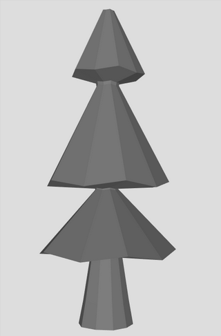
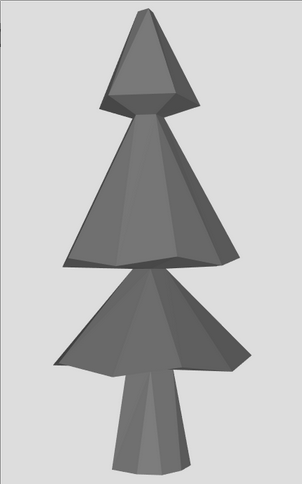
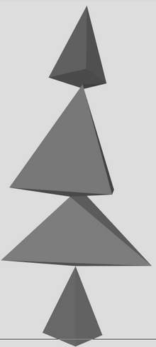
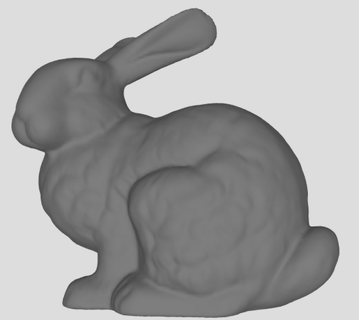
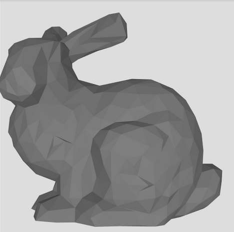
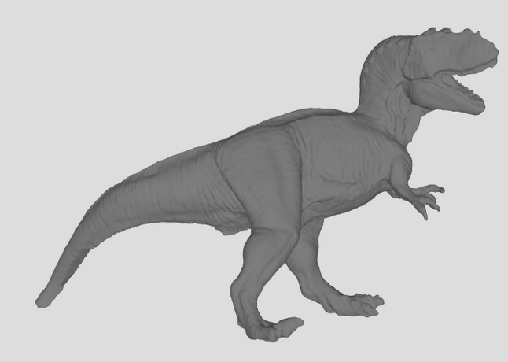
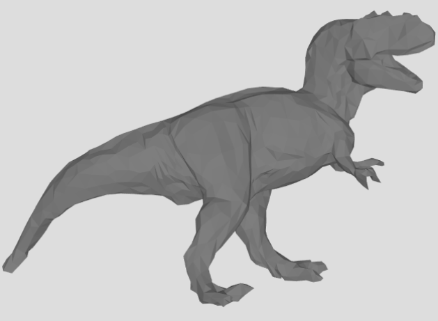

Meshimator
==========

Small mesh decimator project for image synthesis class

## Usage

```
mkdir build
cd build
cmake ..
make
./meshimator input_file output_file target_vertices
```

## Results

### LowPoly tree
Original, 230 vertices | Simplified, 100 vertices | Simplified, 30 vertices
--- | --- | ---
 |  | 

### Stanford Bunny
taken from [prinmath](https://www.prinmath.com/csci5229/OBJ/index.html)
Original, 69000 vertices | Simplified, 1000 vertices
--- | ---
 | 

### Stanford T-Rex
taken from [prinmath](https://www.prinmath.com/csci5229/OBJ/index.html)
Original, 200000 vertices | Simplified, 3000 vertices
--- | ---
 | 
